# 🧩 Checkpoint 5 — Criptografia RSA + Spring Security MVC (FIAP TDS)

## 👨‍💻 Integrantes

- **Nome:** Davi Gonzaga Ferreira
- **RM:** 554890
- **IDE utilizada:** IntelliJ IDEA
- **Turma/Curso:** 2TDSPV

---

## 🧠 Estrutura do Projeto

```
/
├── cp5-socket-rsa/              → Projeto Java (Socket TCP + Criptografia RSA)
├── cp5-spring-security/              → Projeto Spring Boot (Spring Security + PostgreSQL)
├── prints/               → Prints de execução e validação
└── README.md             → Este arquivo
```

---

## 📘 Parte 1 — API Socket com Criptografia RSA

### 🎯 Objetivo

Implementar uma comunicação **Cliente ↔ Servidor** via **Sockets TCP**, aplicando **criptografia RSA** nas duas direções (client → server e server → client).

Cada lado gera suas próprias chaves (`p`, `q`, `n`, `φ`, `e`, `d`), troca as chaves públicas e realiza:

- **Criptografia:** `c = m^e mod n`
- **Descriptografia:** `m = c^d mod n`

---

### ⚙️ Execução

1. **Abra dois terminais**:
   - **Terminal 1:**
     ```bash
     java -cp target/classes br.fiap.cp5.socketrsa.Server
     ```
   - **Terminal 2:**
     ```bash
     java -cp target/classes br.fiap.cp5.socketrsa.Client
     ```
2. **Fluxo de execução:**
   - O **Servidor** gera suas chaves e aguarda conexão.
   - O **Cliente** conecta, envia sua chave pública e uma mensagem criptografada.
   - O **Servidor** decifra e responde também cifrando.
   - Ambos exibem as mensagens originais decifradas no console.

---

### 🖼️ Prints de Execução

**Servidor iniciando e exibindo chaves:**  
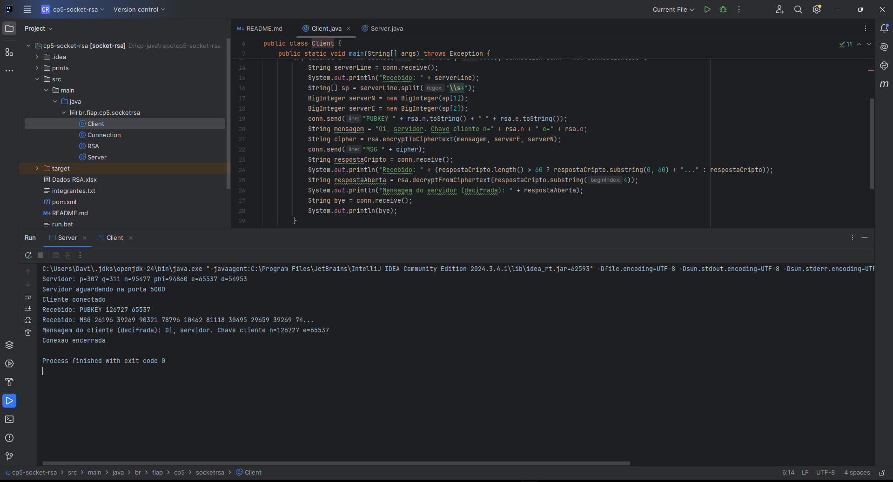

**Cliente enviando e recebendo mensagens cifradas:**  
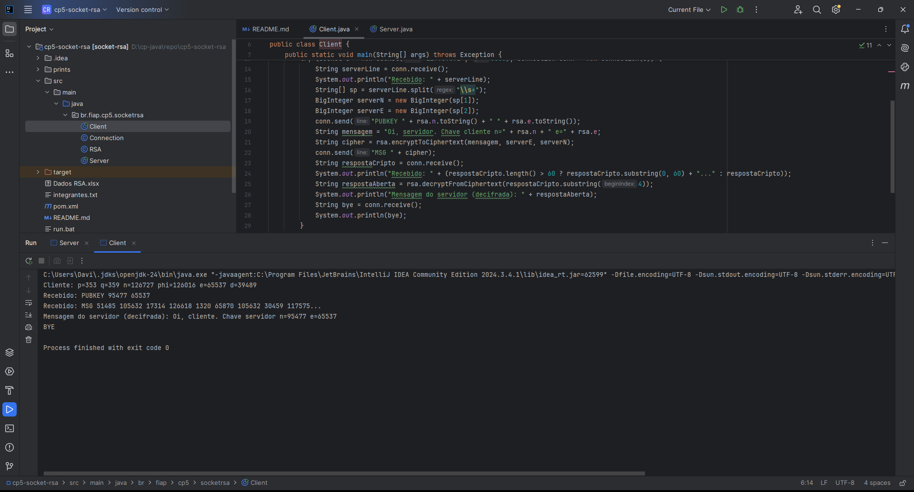

---

### 🔒 Validação no simulador Drexel University

**Simulação da Criptografia e Descriptografia no “RSA Express Encryption–Decryption Calculator”:**  
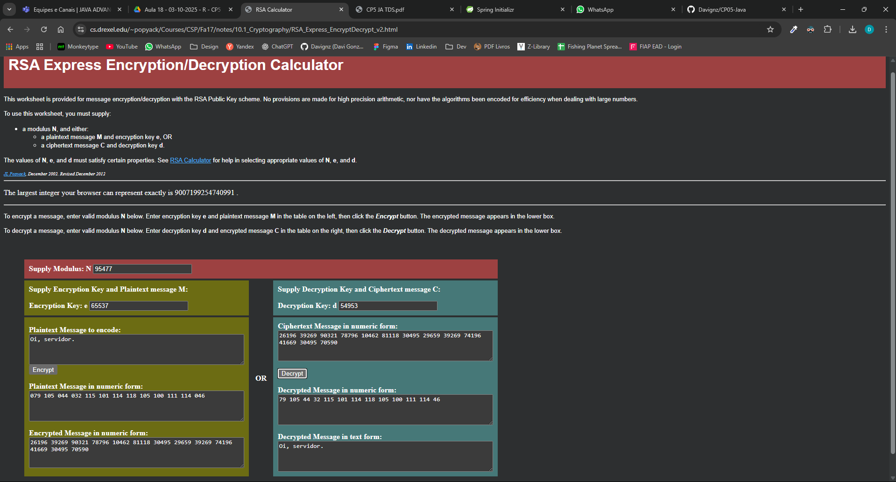

---

## ⚙️ Parte 2 — Spring Security MVC + PostgreSQL

### 🎯 Objetivo

Desenvolver um sistema web para um **Mercado Express**, utilizando o framework **Spring Boot**, com **CRUD completo** e **autenticação/autorização** com **Spring Security** e banco **PostgreSQL**.

O projeto contempla:

- Login customizado (`/login`);
- Cadastro de usuários (`/signup`);
- Perfis **USER** e **ADMIN**;
- CRUD de produtos (restrito ao ADMIN);
- Integração com banco PostgreSQL via **JPA/Hibernate**.

---

### 🧱 Configuração do Banco (Docker)

Para executar localmente:

```bash
docker run --name postgres-cp5 ^
  -e POSTGRES_PASSWORD=postgres ^
  -e POSTGRES_DB=cp5_market ^
  -p 5432:5432 -d postgres:15
```

Teste a conexão:

```bash
docker exec -it postgres-cp5 psql -U postgres -d cp5_market -c "select 1;"
```

---

### 🚀 Execução do Projeto

Na pasta `parte 2`:

```bash
mvn spring-boot:run
```

Acesse no navegador:  
👉 [http://localhost:8080](http://localhost:8080)

---

### 👥 Usuários e Perfis

| Usuário        | Senha                  | Perfil | Observação                              |
| -------------- | ---------------------- | ------ | --------------------------------------- |
| admin          | admin123               | ADMIN  | Criado automaticamente na inicialização |
| (novo usuário) | (definida no cadastro) | USER   | Criado via tela de cadastro             |

---

### 🧩 Prints de Execução

**Aplicação iniciando (Tomcat on port 8080):**  
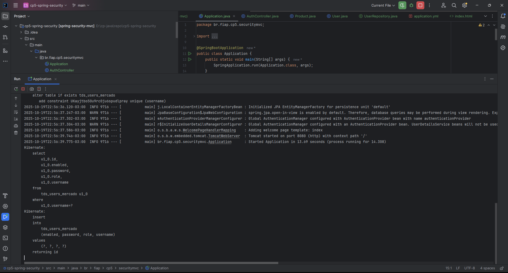

**Tela Home:**  
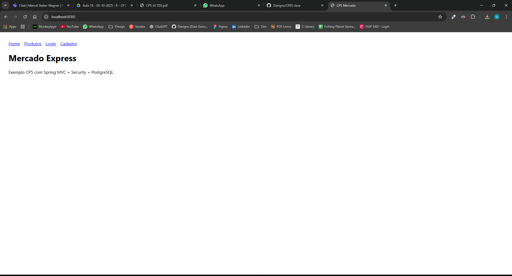

**Cadastro de novo usuário:**  
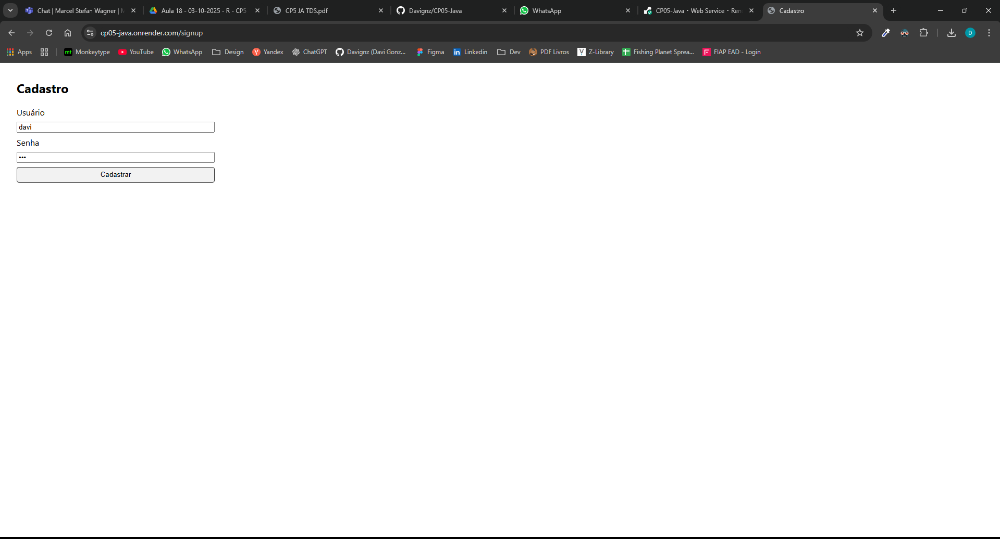

**Usuário comum tentando criar produto (acesso negado):**  
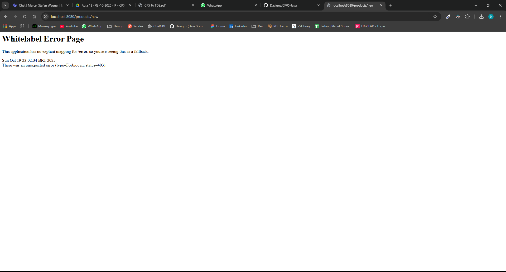

**Admin logado criando novo produto:**  
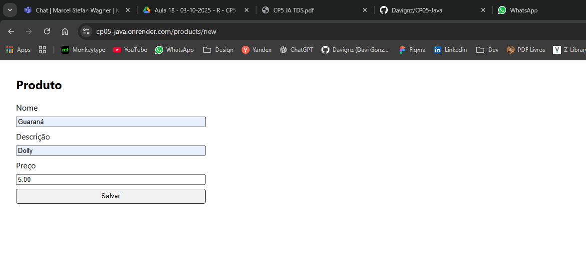

**Produto criado listado na página de produtos:**  
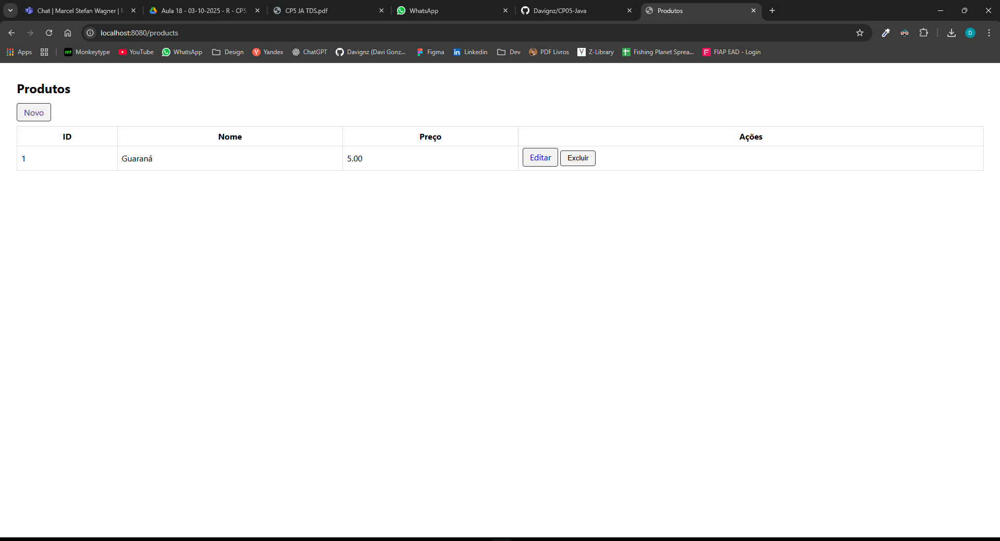

**Edição de produto:**  
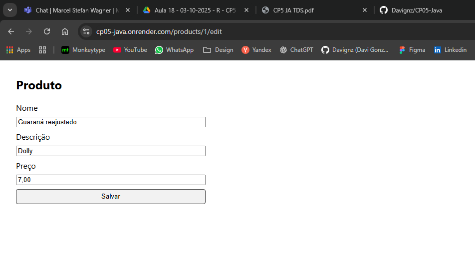

**Produto alterado:**  
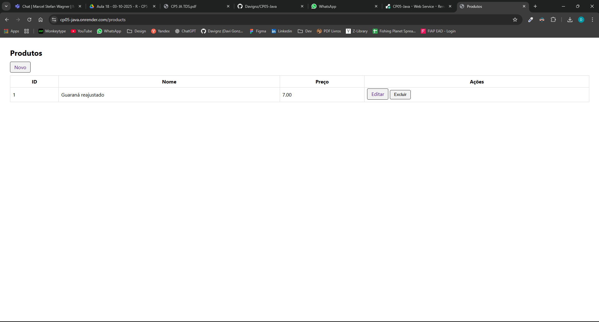

**Produto excluido:**  
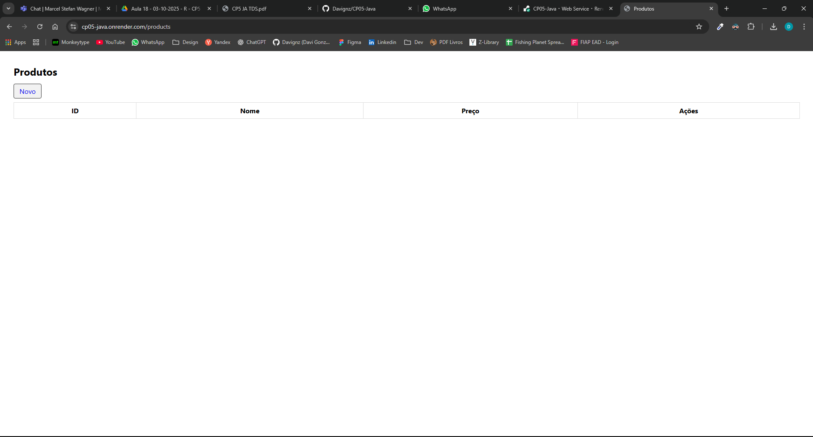

---

### 🗃️ Banco de Dados — Consultas de Validação

**Verificando tabelas e dados via Docker:**

```bash
docker exec -it postgres-cp5 psql -U postgres -d cp5_market -c "\dt"
docker exec -it postgres-cp5 psql -U postgres -d cp5_market -c "select id, username, role, enabled from tds_users_mercado;"
docker exec -it postgres-cp5 psql -U postgres -d cp5_market -c "select id, name, price from tds_sec_mvc_tb_mercado;"
```

---

## 📄 Descrição Final

### ✅ **Parte 1 — RSA via Sockets**

- Cliente/Servidor com criptografia assimétrica;
- Implementação manual do RSA (`m^e mod n`);
- Mensagens trafegam cifradas entre as partes;
- Validação no simulador Drexel.

### ✅ **Parte 2 — Spring Security MVC**

- Aplicação Web com MVC + Spring Security;
- Perfis de acesso USER e ADMIN;
- CRUD completo de produtos com PostgreSQL;
- Deploy possível via Render/Heroku;
- Login, cadastro e controle de sessão implementados.

---

## 🧱 Ferramentas Utilizadas

- **Linguagem:** Java 17
- **Frameworks:** Spring Boot 3.3.2, Spring Security, JPA/Hibernate
- **Banco:** PostgreSQL 15 (Docker)
- **IDE:** IntelliJ IDEA Community
- **Build Tool:** Maven
- **Validação RSA:** RSA Express Calculator (Drexel University)
